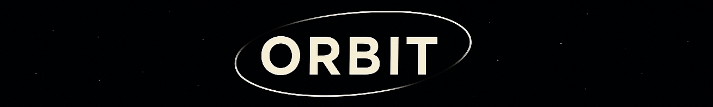
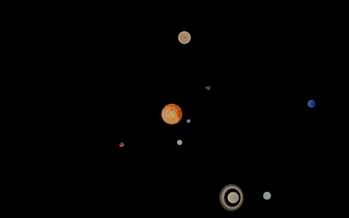
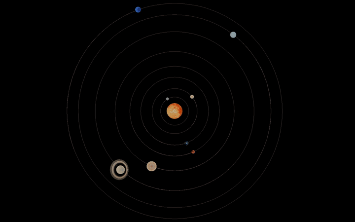

    

Orbit is an interactive solar system simulator that models all eight planets and the sun. Explore a vast cosmos of 
celestial bodies in three dimensions and control gravity to witness the chaotic effects of the resultant 
gravitational interactions.
    

        
        
    

Visualise our solar system at different scales, observing both the relative sizes of
and distances between the planets and sun.
    

         
        
        
        
 Default View&nbsp;&nbsp;&nbsp;&nbsp;—&nbsp;&nbsp;&nbsp;&nbsp;True Distance&nbsp;&nbsp;&nbsp;&nbsp;—&nbsp;&nbsp;&nbsp;&nbsp;True Size
    

### See installation guides for [Linux / MacOS](Assets/installation_linux_macos.md) and [Windows](Assets/installation_windows.md)

## Usage
### Cursor Controls
- `Left click and drag` to move horizontal and vertical camera position  

- `Right click and drag` to change vertical camera perspective

  - By default, perspective is shifted relative to the sun  
  - If hovering over or tracking a planet, perspective shifts relative to that planet

- `Scroll` to adjust zoom

- `SHIFT` + `Left Click` on a planet to track its orbit

### Keyboard Controls
- `Up Arrow` and `Down Arrow` to increment and decrement gravity

- `Right Arrow` and `Left Arrow` to increment and decrement simulation time-step

- `Spacebar` to pause/resume simulation

- `V` to rotate between visualisation modes `DEFAULT` → `TRUE DISTANCE` → `TRUE SIZE` (see below)

- `R` to reset simulation

- `Q` to randomise planetary orbit positions

- `O` to toggle on/off orbit lines

- `C` to toggle on/off cursor

- `F` to toggle on/off fullscreen

- `ESC` to exit program

[//]: # (## Visualisation Modes)

[//]: # (
)

[//]: # (    
)

[//]: # (        )

[//]: # (        )

[//]: # (        )

[//]: # (    
)

[//]: # (Default View &#40;left&#41;, True Distance &#40;middle&#41;, True Size &#40;right&#41;)

[//]: # (  )

[//]: # (
)
